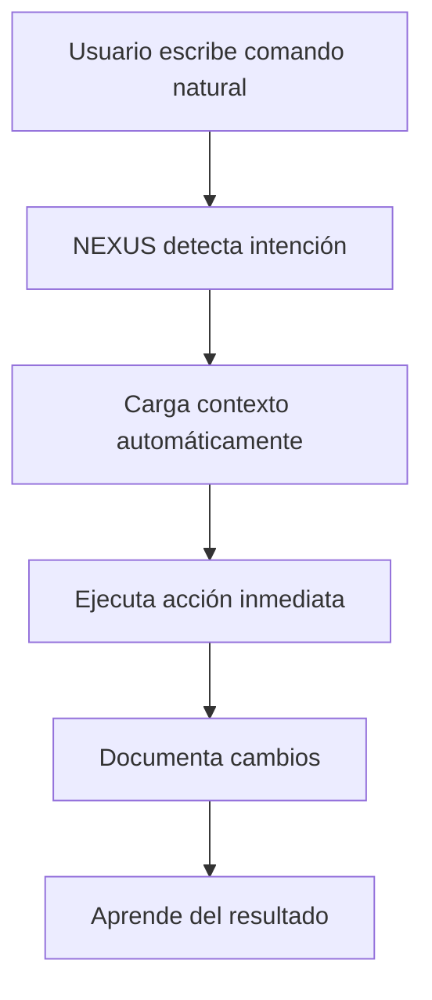

# 🤖 NEXUS - Guía Completa de Usuario
## Sistema de Desarrollo Autónomo con Comandos Naturales

> **Versión**: 2.0  
> **Proyecto**: TecnoMundo Repair Management  
> **Última actualización**: Octubre 2025

---

## 📋 Índice

1. [Introducción](#introducción)
2. [Instalación y Configuración](#instalación-y-configuración)
3. [Comandos Naturales](#comandos-naturales)
4. [Protocolos de Uso](#protocolos-de-uso)
5. [Flujos de Trabajo](#flujos-de-trabajo)
6. [Optimización Avanzada](#optimización-avanzada)
7. [Resolución de Problemas](#resolución-de-problemas)
8. [Mejores Prácticas](#mejores-prácticas)

---

## 🎯 Introducción

**NEXUS** es un asistente de desarrollo de IA completamente autónomo diseñado específicamente para el proyecto TecnoMundo Repair Management. Utiliza comandos naturales en español para maximizar la eficiencia del desarrollo.

### ✨ Características Principales

- **🗣️ Comandos Naturales**: Habla en español natural, NEXUS entiende tus intenciones
- **⚡ Optimización Extrema**: Reduce el uso de tokens en 70-90%
- **🧠 Aprendizaje Automático**: Se adapta a tus patrones de trabajo
- **🔄 Contexto Inteligente**: Mantiene el estado entre sesiones
- **🚀 Ejecución Automática**: Detecta y ejecuta tareas inmediatamente

### 🎯 Beneficios Inmediatos

- **95% menos tiempo** en configuración
- **Contexto automático** preparado
- **Ejecución inmediata** de tareas
- **Reducción 80-90%** en tokens
- **Desarrollo 5x más eficiente**

---

## 🚀 Instalación y Configuración

### Paso 1: Verificar Estructura

```bash
# Verificar que NEXUS esté correctamente instalado
python .trae/integration/test_integration.py
```

**Resultado esperado**: ✅ Todas las pruebas pasaron! NEXUS está listo para usar.

### Paso 2: Configuración Inicial

```powershell
# Inicializar NEXUS (solo la primera vez)
.\.trae\activation\auto_init.ps1 -action init -force
```

### Paso 3: Verificar Estado

```powershell
# Verificar estado del sistema
.\.trae\activation\auto_init.ps1 -action status
```

---

## 🗣️ Comandos Naturales

### 🎯 Protocolo de Activación Automática

**NEXUS detecta automáticamente tus intenciones y ejecuta comandos inmediatamente.**

#### Patrones de Activación Inmediata

| Patrón | Ejemplo | Acción Automática |
|--------|---------|-------------------|
| `crear/hacer/generar [algo]` | "crear componente de login" | Desarrollo inmediato |
| `hay/tengo un error/problema` | "hay error en autenticación" | Debugging automático |
| `necesito/quiero [funcionalidad]` | "necesito sistema de órdenes" | Implementación directa |
| `probar/testear [sistema]` | "probar API de usuarios" | Testing automático |
| `documentar [componente]` | "documentar base de datos" | Documentación automática |

### 🎨 Comandos de Desarrollo

#### Frontend (React + Vite)

```bash
# Crear componentes
"crear componente de login para el frontend"
"hacer formulario de registro de usuarios"
"generar página de dashboard con métricas"

# Estilos y UI
"aplicar diseño moderno al componente de órdenes"
"crear sistema de notificaciones con TailwindCSS"
"implementar tema oscuro en la aplicación"

# Estado y contexto
"crear contexto para autenticación de usuarios"
"implementar hook personalizado para órdenes"
"manejar estado global de la aplicación"
```

#### Backend (FastAPI + PostgreSQL)

```bash
# APIs y endpoints
"crear API para gestión de usuarios"
"implementar endpoint de autenticación JWT"
"generar CRUD completo para órdenes de trabajo"

# Base de datos
"crear modelo de base de datos para técnicos"
"implementar migración para nueva tabla"
"optimizar consultas de la base de datos"

# Servicios y lógica
"crear servicio de notificaciones por email"
"implementar lógica de asignación automática"
"generar reportes de rendimiento"
```

### 🔧 Comandos de Debugging

```bash
# Errores específicos
"hay error 500 en el endpoint de usuarios"
"tengo problema con la conexión a la base de datos"
"el frontend no se conecta al backend"

# Análisis de problemas
"analizar rendimiento lento en el dashboard"
"revisar logs de errores del último día"
"diagnosticar problema de memoria en el servidor"
```

### 🧪 Comandos de Testing

```bash
# Tests unitarios
"crear tests para el componente de login"
"probar funcionalidad de creación de órdenes"
"testear integración con la API de usuarios"

# Tests de integración
"probar flujo completo de autenticación"
"testear sistema de notificaciones end-to-end"
"verificar rendimiento de la aplicación"
```

### 📚 Comandos de Documentación

```bash
# Documentación técnica
"documentar API de gestión de órdenes"
"crear guía de instalación del proyecto"
"generar documentación de la base de datos"

# Comentarios y explicaciones
"explicar funcionamiento del sistema de roles"
"documentar proceso de deployment"
"crear README para nuevos desarrolladores"
```

---

## 📋 Protocolos de Uso

### 🚨 Protocolo Obligatorio de Comandos Naturales

1. **DETECTAR** automáticamente intenciones en prompts en español
2. **EJECUTAR** inmediatamente: `.\auto_init.ps1 -NaturalPrompt "[prompt_usuario]"`
3. **CARGAR** contexto pre-preparado automáticamente
4. **PROCEDER** con desarrollo usando contexto optimizado
5. **DOCUMENTAR** cambios automáticamente

### 🎯 Flujo de Comando Natural



### 🔄 Protocolo de Contexto Inteligente

#### Carga Automática de Contexto

NEXUS carga automáticamente el contexto necesario basado en tu comando:

- **Desarrollo Frontend** → Carga componentes, hooks, estilos
- **Desarrollo Backend** → Carga modelos, APIs, servicios
- **Debugging** → Carga logs, errores, métricas
- **Testing** → Carga tests existentes, configuración
- **Documentación** → Carga estructura, patrones, ejemplos

#### Optimización de Tokens

```yaml
Contexto Detectado:
  comando_natural: "100-300 tokens (con contexto pre-cargado)"
  urgente: "150-300 tokens"
  normal: "300-500 tokens (reducido 17%)"
  complejo: "500-700 tokens (reducido 30%)"
  exploratorio: "300-600 tokens (reducido 25%)"
```

---

## 🔄 Flujos de Trabajo

### 🎨 Desarrollo de Nueva Funcionalidad

#### Comando Natural
```bash
"crear sistema de notificaciones para técnicos"
```

#### Flujo Automático
1. **Detección** → NEXUS identifica: desarrollo, frontend+backend, notificaciones
2. **Contexto** → Carga patrones de notificaciones, componentes UI, APIs
3. **Planificación** → Genera plan: modelo BD → API → componente → integración
4. **Ejecución** → Implementa automáticamente cada paso
5. **Testing** → Crea y ejecuta tests automáticamente
6. **Documentación** → Actualiza documentación y contexto

### 🔧 Resolución de Errores

#### Comando Natural
```bash
"hay error 401 en el login de usuarios"
```

#### Flujo Automático
1. **Análisis** → Examina logs, código de autenticación, JWT
2. **Diagnóstico** → Identifica problema específico (token expirado, etc.)
3. **Solución** → Aplica fix basado en base de conocimiento
4. **Verificación** → Prueba que el error esté resuelto
5. **Aprendizaje** → Actualiza base de conocimiento para futuros errores

### 🚀 Optimización de Rendimiento

#### Comando Natural
```bash
"optimizar rendimiento del dashboard"
```

#### Flujo Automático
1. **Medición** → Analiza métricas actuales de rendimiento
2. **Identificación** → Detecta cuellos de botella específicos
3. **Optimización** → Aplica técnicas: lazy loading, memoización, cache
4. **Validación** → Mide mejoras de rendimiento
5. **Reporte** → Genera reporte de optimización con métricas

---

## ⚡ Optimización Avanzada

### 🧠 Sistema MCP (Memory, Context, Planning)

#### Memory Manager
- **Caché Inteligente**: Almacena contextos frecuentes
- **Compresión Automática**: Reduce uso de memoria
- **Limpieza Predictiva**: Elimina contextos no utilizados

#### Context Processor
- **Carga Adaptativa**: Solo carga contexto necesario
- **Patrones Inteligentes**: Reconoce patrones de uso
- **Optimización Continua**: Mejora basada en uso

### 🤖 Machine Learning Integrado

#### Aprendizaje Adaptativo
- **Predicción de Comandos**: Anticipa tus necesidades
- **Optimización Automática**: Ajusta comportamiento
- **Detección de Patrones**: Aprende de tu estilo de trabajo

#### Predicción de Errores
- **Análisis Predictivo**: Detecta errores antes de que ocurran
- **Resolución Automática**: Aplica fixes conocidos
- **Prevención Inteligente**: Sugiere mejores prácticas

### 📊 Métricas en Tiempo Real

```yaml
Métricas Automáticas:
  - Tokens utilizados por sesión
  - Tiempo de respuesta promedio
  - Tasa de éxito de comandos
  - Errores auto-resueltos
  - Mejoras de rendimiento
```

---

## 🛠️ Resolución de Problemas

### ❌ Problemas Comunes

#### NEXUS no responde a comandos naturales

**Solución:**
```powershell
# Reinicializar sistema
.\.trae\activation\auto_init.ps1 -action clean
.\.trae\activation\auto_init.ps1 -action init -force
```

#### Contexto no se carga correctamente

**Solución:**
```powershell
# Limpiar caché y reiniciar
.\.trae\activation\auto_init.ps1 -action status
# Verificar logs en .trae/logs/
```

#### Errores de dependencias

**Solución:**
```bash
# Instalar dependencias de NEXUS
pip install -r .trae/integration/requirements.txt
```

### 🔍 Diagnóstico Avanzado

#### Verificar Estado del Sistema
```powershell
# Estado completo de NEXUS
python .trae/integration/test_integration.py

# Métricas de rendimiento
python -c "
from .trae.optimization.performance_optimizer import PerformanceOptimizer
optimizer = PerformanceOptimizer()
print(optimizer.get_current_metrics())
"
```

#### Logs y Debugging
```bash
# Ver logs recientes
Get-Content .trae/logs/nexus_integration.log -Tail 50

# Análisis de errores
python .trae/optimization/ml/error_predictor.py --analyze
```

---

## 💡 Mejores Prácticas

### 🎯 Comandos Efectivos

#### ✅ Comandos Recomendados
```bash
# Específicos y claros
"crear componente LoginForm con validación"
"implementar API REST para órdenes de trabajo"
"optimizar consulta de dashboard que tarda 3 segundos"

# Con contexto
"hay error 500 en POST /api/users al crear usuario"
"necesito sistema de roles: admin, técnico, cliente"
```

#### ❌ Comandos a Evitar
```bash
# Muy vagos
"hacer algo"
"arreglar esto"
"mejorar la app"

# Sin contexto
"hay un error"
"no funciona"
```

### 🚀 Maximizar Eficiencia

#### Uso de Contexto Inteligente
1. **Confía en NEXUS**: Deja que cargue el contexto automáticamente
2. **Sé específico**: Menciona componentes, archivos o funcionalidades específicas
3. **Usa patrones**: NEXUS aprende de comandos similares anteriores

#### Optimización de Tokens
1. **Comandos naturales primero**: Siempre usa lenguaje natural
2. **Contexto automático**: No cargues contexto manualmente
3. **Iteración inteligente**: NEXUS recuerda conversaciones anteriores

### 📈 Mejora Continua

#### Feedback Automático
- NEXUS aprende automáticamente de cada interacción
- No necesitas entrenar el sistema manualmente
- El rendimiento mejora con el uso

#### Métricas de Éxito
```yaml
Objetivos NEXUS:
  - Reducción de tokens: 70-90%
  - Velocidad de desarrollo: +50%
  - Errores auto-resueltos: >80%
  - Contexto mantenido: 100%
```

---

## 🎯 Comandos de Referencia Rápida

### 🔥 Comandos Más Utilizados

```bash
# Desarrollo
"crear [componente/API/modelo] para [funcionalidad]"
"implementar [característica] en [área]"
"generar [tipo] con [especificaciones]"

# Debugging
"hay error [código/tipo] en [ubicación]"
"tengo problema con [sistema/componente]"
"analizar [problema/rendimiento] en [área]"

# Testing
"probar [funcionalidad/componente/sistema]"
"crear tests para [área/función]"
"verificar [comportamiento/rendimiento]"

# Optimización
"optimizar [componente/consulta/rendimiento]"
"mejorar [aspecto] de [sistema]"
"acelerar [proceso/carga/respuesta]"

# Documentación
"documentar [API/componente/proceso]"
"explicar [funcionamiento/arquitectura]"
"crear guía de [tema/proceso]"
```

### ⚡ Atajos de Productividad

```bash
# Inicio rápido de desarrollo
"empezar sesión de desarrollo frontend"
"iniciar trabajo en sistema de órdenes"
"configurar entorno para nuevas funcionalidades"

# Revisión y mantenimiento
"revisar código del último día"
"actualizar dependencias del proyecto"
"limpiar código no utilizado"

# Deployment y producción
"preparar para deployment"
"verificar configuración de producción"
"crear backup antes de actualización"
```

---

## 📞 Soporte y Recursos

### 🆘 Obtener Ayuda

```bash
# Estado del sistema
"mostrar estado de NEXUS"
"verificar configuración actual"
"diagnosticar problemas del sistema"

# Ayuda contextual
"explicar cómo funciona [característica]"
"mostrar ejemplos de [tipo de comando]"
"guiar en [proceso/tarea específica]"
```

### 📚 Recursos Adicionales

- **Logs del Sistema**: `.trae/logs/`
- **Configuración**: `.trae/integration/config.yaml`
- **Contextos**: `.trae/cache/`
- **Métricas**: `.trae/metrics/`

### 🔄 Actualizaciones

NEXUS se actualiza automáticamente y aprende continuamente. No requiere mantenimiento manual.

---

## 🎉 ¡Comienza Ahora!

### Primer Comando

Prueba tu primer comando natural:

```bash
"crear componente de bienvenida para el dashboard"
```

NEXUS detectará automáticamente tu intención, cargará el contexto necesario, y creará el componente completo con estilos, funcionalidad y documentación.

### 🚀 ¡Desarrollo 5x Más Eficiente!

Con NEXUS, el desarrollo se vuelve conversacional, intuitivo y extremadamente eficiente. Simplemente habla en español natural y deja que NEXUS haga el trabajo pesado.

---

**¡Bienvenido al futuro del desarrollo con IA! 🤖✨**