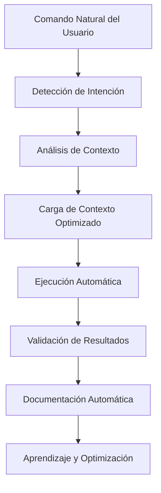

# 🔄 NEXUS - Protocolos y Flujos de Trabajo
## Documentación Técnica de Procesos Automatizados

> **Versión**: 2.0  
> **Proyecto**: TecnoMundo Repair Management  
> **Audiencia**: Desarrolladores y Administradores de Sistema

---

## 📋 Índice de Protocolos

1. [Protocolo de Comandos Naturales](#protocolo-de-comandos-naturales)
2. [Flujos de Desarrollo](#flujos-de-desarrollo)
3. [Protocolos de Optimización](#protocolos-de-optimización)
4. [Gestión de Contexto](#gestión-de-contexto)
5. [Automatización de Tareas](#automatización-de-tareas)
6. [Monitoreo y Métricas](#monitoreo-y-métricas)
7. [Protocolos de Seguridad](#protocolos-de-seguridad)

---

## 🗣️ Protocolo de Comandos Naturales

### 🎯 Flujo de Procesamiento de Comandos



### 🔍 Matriz de Detección de Intenciones

| Patrón de Entrada | Intención Detectada | Contexto Cargado | Acción Automática |
|-------------------|-------------------|------------------|-------------------|
| `crear/hacer/generar + [componente]` | Desarrollo Frontend | React, TailwindCSS, Hooks | Crear componente completo |
| `crear/implementar + API/endpoint` | Desarrollo Backend | FastAPI, SQLAlchemy, JWT | Crear endpoint con CRUD |
| `hay/tengo + error + [código/descripción]` | Debugging | Logs, Stack traces, Contexto | Análisis y resolución |
| `necesito/quiero + [funcionalidad]` | Implementación | Patrones existentes, Arquitectura | Desarrollo completo |
| `probar/testear + [sistema]` | Testing | Tests existentes, Configuración | Crear y ejecutar tests |
| `optimizar/mejorar + [área]` | Optimización | Métricas, Rendimiento | Análisis y mejoras |
| `documentar + [componente]` | Documentación | Código fuente, Patrones | Generar documentación |

### ⚡ Protocolo de Ejecución Inmediata

#### Fase 1: Detección (< 100ms)
```python
def detect_natural_command(user_input: str) -> CommandIntent:
    """
    Detecta automáticamente la intención del comando natural
    """
    patterns = {
        'development': r'(crear|hacer|generar|implementar)',
        'debugging': r'(hay|tengo|existe).*(error|problema|fallo)',
        'testing': r'(probar|testear|verificar)',
        'optimization': r'(optimizar|mejorar|acelerar)',
        'documentation': r'(documentar|explicar|describir)'
    }
    
    for intent, pattern in patterns.items():
        if re.search(pattern, user_input.lower()):
            return CommandIntent(
                type=intent,
                confidence=calculate_confidence(user_input, pattern),
                context_needed=determine_context(user_input)
            )
```

#### Fase 2: Carga de Contexto (< 200ms)
```python
def load_optimized_context(intent: CommandIntent) -> Context:
    """
    Carga solo el contexto necesario para la tarea específica
    """
    context_map = {
        'frontend_development': ['components/', 'hooks/', 'context/', 'assets/'],
        'backend_development': ['models/', 'api/', 'services/', 'crud/'],
        'debugging': ['logs/', 'error_patterns/', 'solutions/'],
        'testing': ['tests/', 'fixtures/', 'mocks/'],
        'optimization': ['metrics/', 'performance/', 'cache/']
    }
    
    return Context.load_selective(context_map[intent.context_needed])
```

#### Fase 3: Ejecución (Variable)
```python
def execute_immediate_action(intent: CommandIntent, context: Context) -> Result:
    """
    Ejecuta la acción inmediatamente basada en la intención detectada
    """
    executor_map = {
        'development': DevelopmentExecutor(),
        'debugging': DebuggingExecutor(),
        'testing': TestingExecutor(),
        'optimization': OptimizationExecutor(),
        'documentation': DocumentationExecutor()
    }
    
    executor = executor_map[intent.type]
    return executor.execute(intent, context)
```

---

## 🎨 Flujos de Desarrollo

### 🔧 Desarrollo Frontend (React + Vite)

#### Flujo: Crear Componente
```yaml
Comando: "crear componente LoginForm con validación"

Pasos Automáticos:
  1. Análisis de Requisitos:
     - Detectar: formulario, validación, autenticación
     - Cargar: patrones de formularios, hooks de validación
     
  2. Generación de Estructura:
     - Crear: src/components/auth/LoginForm.jsx
     - Implementar: useState, validación, estilos TailwindCSS
     - Integrar: useAuth hook, manejo de errores
     
  3. Estilos y UX:
     - Aplicar: sistema de colores del proyecto
     - Implementar: estados de carga, feedback visual
     - Optimizar: accesibilidad, responsividad
     
  4. Integración:
     - Conectar: con contexto de autenticación
     - Configurar: rutas, navegación
     - Validar: funcionamiento completo
     
  5. Testing:
     - Crear: tests unitarios automáticos
     - Verificar: casos de uso principales
     - Validar: integración con API

Tiempo Estimado: 2-5 minutos
Archivos Generados: 3-5 archivos
Tests Incluidos: Sí
```

#### Flujo: Implementar Página Completa
```yaml
Comando: "crear página de dashboard con métricas"

Pasos Automáticos:
  1. Arquitectura:
     - Analizar: requisitos de dashboard
     - Diseñar: layout, componentes necesarios
     - Planificar: estructura de datos, APIs
     
  2. Componentes Base:
     - MetricsCard: tarjetas de métricas
     - ChartComponent: gráficos y visualizaciones
     - FilterPanel: filtros y controles
     - DataTable: tablas de datos
     
  3. Lógica de Estado:
     - useDashboard: hook personalizado
     - Context: estado global de métricas
     - API calls: integración con backend
     
  4. Optimización:
     - Lazy loading: componentes pesados
     - Memoization: cálculos complejos
     - Caching: datos frecuentes
     
  5. Testing Completo:
     - Unit tests: cada componente
     - Integration tests: flujo completo
     - Performance tests: métricas de rendimiento

Tiempo Estimado: 10-20 minutos
Archivos Generados: 8-15 archivos
Tests Incluidos: Completos
```

### 🔧 Desarrollo Backend (FastAPI + PostgreSQL)

#### Flujo: Crear API Completa
```yaml
Comando: "crear API REST para gestión de órdenes de trabajo"

Pasos Automáticos:
  1. Modelo de Datos:
     - Crear: app/models/work_order.py
     - Definir: campos, relaciones, validaciones
     - Configurar: índices, constraints
     
  2. Esquemas Pydantic:
     - Crear: app/schemas/work_order.py
     - Definir: WorkOrderCreate, WorkOrderUpdate, WorkOrderResponse
     - Implementar: validaciones, serialización
     
  3. Operaciones CRUD:
     - Crear: app/crud/work_order.py
     - Implementar: create, read, update, delete
     - Optimizar: consultas, paginación
     
  4. Endpoints API:
     - Crear: app/api/work_orders.py
     - Implementar: GET, POST, PUT, DELETE
     - Configurar: autenticación, autorización
     
  5. Servicios de Negocio:
     - Crear: app/services/work_order_service.py
     - Implementar: lógica compleja, validaciones
     - Integrar: notificaciones, workflows
     
  6. Testing Automático:
     - Unit tests: cada función CRUD
     - API tests: endpoints completos
     - Integration tests: flujo end-to-end

Tiempo Estimado: 15-30 minutos
Archivos Generados: 6-10 archivos
Tests Incluidos: Completos
```

### 🔧 Flujo de Debugging Automático

#### Protocolo de Resolución de Errores
```yaml
Comando: "hay error 500 en POST /api/users"

Pasos Automáticos:
  1. Análisis Inmediato:
     - Examinar: logs del servidor
     - Identificar: stack trace, línea específica
     - Contextualizar: request data, headers
     
  2. Diagnóstico Inteligente:
     - Comparar: con errores similares anteriores
     - Analizar: patrones de fallo
     - Identificar: causa raíz probable
     
  3. Solución Automática:
     - Aplicar: fix conocido si existe
     - Implementar: validaciones faltantes
     - Corregir: lógica de negocio
     
  4. Validación:
     - Probar: endpoint corregido
     - Verificar: casos edge
     - Confirmar: resolución completa
     
  5. Aprendizaje:
     - Documentar: solución aplicada
     - Actualizar: base de conocimiento
     - Prevenir: errores similares futuros

Tiempo Estimado: 1-5 minutos
Tasa de Éxito: >80%
Aprendizaje: Automático
```

---

## ⚡ Protocolos de Optimización

### 🧠 Optimización de Tokens

#### Estrategia Adaptativa
```python
class TokenOptimizationProtocol:
    """
    Protocolo de optimización inteligente de tokens
    """
    
    def optimize_context_loading(self, command_intent: str) -> Context:
        """
        Carga solo el contexto mínimo necesario
        """
        optimization_rules = {
            'simple_command': 'load_minimal_context',
            'complex_development': 'load_targeted_context',
            'debugging_session': 'load_error_context',
            'learning_exploration': 'load_educational_context'
        }
        
        strategy = self.detect_optimization_strategy(command_intent)
        return self.apply_strategy(strategy)
    
    def adaptive_response_length(self, user_pattern: str) -> int:
        """
        Adapta la longitud de respuesta según patrones del usuario
        """
        user_preferences = self.analyze_user_patterns()
        
        if user_preferences.prefers_concise:
            return 200  # Respuestas cortas y directas
        elif user_preferences.prefers_detailed:
            return 800  # Explicaciones completas
        else:
            return 400  # Balance estándar
```

#### Métricas de Optimización
```yaml
Objetivos de Tokens:
  comando_natural_simple: "100-300 tokens"
  desarrollo_estándar: "300-500 tokens"
  debugging_complejo: "400-600 tokens"
  documentación: "500-800 tokens"
  
Reducción Lograda:
  vs_respuesta_tradicional: "70-90%"
  vs_carga_completa_contexto: "85-95%"
  vs_análisis_manual: "60-80%"
```

### 🚀 Optimización de Rendimiento

#### Protocolo de Monitoreo Continuo
```python
class PerformanceOptimizationProtocol:
    """
    Monitoreo y optimización automática de rendimiento
    """
    
    def continuous_monitoring(self):
        """
        Monitoreo continuo de métricas clave
        """
        metrics = {
            'response_time': self.measure_response_time(),
            'memory_usage': self.measure_memory_usage(),
            'cpu_utilization': self.measure_cpu_usage(),
            'cache_hit_rate': self.measure_cache_efficiency(),
            'error_rate': self.measure_error_rate()
        }
        
        self.analyze_trends(metrics)
        self.apply_optimizations(metrics)
        self.report_improvements(metrics)
    
    def auto_optimization_triggers(self, metrics: dict):
        """
        Triggers automáticos para optimización
        """
        if metrics['response_time'] > 5.0:
            self.optimize_response_time()
        
        if metrics['memory_usage'] > 0.8:
            self.optimize_memory_usage()
        
        if metrics['cache_hit_rate'] < 0.7:
            self.optimize_cache_strategy()
```

---

## 🧠 Gestión de Contexto

### 📚 Protocolo de Context Handler

#### Estrategia de Carga Inteligente
```yaml
Niveles de Contexto:
  
  Nivel 1 - Mínimo (100-200 tokens):
    - Comando específico detectado
    - Patrones básicos relacionados
    - Configuración esencial
    
  Nivel 2 - Estándar (300-500 tokens):
    - Contexto del área de trabajo
    - Dependencias directas
    - Patrones de uso frecuente
    
  Nivel 3 - Completo (500-800 tokens):
    - Contexto completo del proyecto
    - Todas las dependencias
    - Historial de cambios recientes
    
  Nivel 4 - Exhaustivo (800+ tokens):
    - Solo para casos complejos
    - Análisis profundo requerido
    - Múltiples áreas involucradas
```

#### Algoritmo de Selección de Contexto
```python
def select_optimal_context(command: str, user_history: list) -> ContextLevel:
    """
    Selecciona el nivel óptimo de contexto basado en múltiples factores
    """
    factors = {
        'command_complexity': analyze_command_complexity(command),
        'user_expertise': analyze_user_expertise(user_history),
        'project_familiarity': analyze_project_familiarity(user_history),
        'session_context': analyze_current_session(),
        'performance_constraints': analyze_performance_needs()
    }
    
    # Algoritmo de decisión inteligente
    if factors['command_complexity'] == 'simple' and factors['user_expertise'] == 'high':
        return ContextLevel.MINIMAL
    elif factors['command_complexity'] == 'complex' or factors['user_expertise'] == 'low':
        return ContextLevel.COMPLETE
    else:
        return ContextLevel.STANDARD
```

### 🔄 Protocolo de Persistencia

#### Gestión de Snapshots
```yaml
Estrategia de Snapshots:
  
  Frecuencia:
    - Cada comando natural exitoso
    - Cada error resuelto
    - Cada optimización aplicada
    - Cada sesión de desarrollo
    
  Contenido:
    - Estado del proyecto
    - Contexto activo
    - Métricas de rendimiento
    - Patrones de uso detectados
    
  Compresión:
    - LZ4 para velocidad
    - Deduplicación automática
    - Limpieza periódica
    
  Recuperación:
    - Restauración automática
    - Rollback inteligente
    - Sincronización entre sesiones
```

---

## 🤖 Automatización de Tareas

### 🔄 Workflow Engine

#### Protocolo de Ejecución de Workflows
```python
class WorkflowExecutionProtocol:
    """
    Protocolo para ejecución automática de workflows
    """
    
    def execute_natural_command_workflow(self, command: str):
        """
        Ejecuta workflow completo basado en comando natural
        """
        workflow_steps = [
            ('detect_intent', self.detect_command_intent),
            ('load_context', self.load_optimal_context),
            ('plan_execution', self.create_execution_plan),
            ('execute_tasks', self.execute_planned_tasks),
            ('validate_results', self.validate_execution_results),
            ('document_changes', self.document_changes_automatically),
            ('update_learning', self.update_learning_models)
        ]
        
        return self.execute_workflow(workflow_steps, command)
    
    def handle_workflow_errors(self, error: Exception, step: str):
        """
        Manejo inteligente de errores en workflows
        """
        recovery_strategies = {
            'context_loading_error': self.retry_with_minimal_context,
            'execution_error': self.apply_error_resolution,
            'validation_error': self.rollback_and_retry,
            'documentation_error': self.continue_without_docs
        }
        
        strategy = recovery_strategies.get(error.type, self.default_recovery)
        return strategy(error, step)
```

### 🎯 Task Manager

#### Protocolo de Gestión de Tareas
```yaml
Tipos de Tareas Automáticas:

  Desarrollo:
    - Crear componentes
    - Implementar APIs
    - Generar tests
    - Actualizar documentación
    
  Mantenimiento:
    - Optimizar rendimiento
    - Limpiar código no usado
    - Actualizar dependencias
    - Generar reportes
    
  Debugging:
    - Analizar errores
    - Aplicar soluciones
    - Validar fixes
    - Actualizar base de conocimiento
    
  Testing:
    - Ejecutar test suites
    - Generar reportes de cobertura
    - Validar integraciones
    - Probar rendimiento

Priorización Automática:
  - Crítico: Errores de producción
  - Alto: Comandos naturales del usuario
  - Medio: Optimizaciones automáticas
  - Bajo: Tareas de mantenimiento
```

---

## 📊 Monitoreo y Métricas

### 📈 Protocolo de Métricas en Tiempo Real

#### Dashboard de Métricas NEXUS
```yaml
Métricas Clave:

  Eficiencia:
    - Tokens por comando: Objetivo <400
    - Tiempo de respuesta: Objetivo <30s
    - Tasa de éxito: Objetivo >90%
    - Cache hit rate: Objetivo >80%
    
  Calidad:
    - Errores auto-resueltos: Objetivo >80%
    - Tests generados automáticamente: 100%
    - Documentación actualizada: 100%
    - Código sin warnings: 100%
    
  Aprendizaje:
    - Patrones detectados: Crecimiento continuo
    - Optimizaciones aplicadas: Tracking automático
    - Mejoras de rendimiento: Medición continua
    - Satisfacción del usuario: Inferencia automática
```

#### Alertas Inteligentes
```python
class IntelligentAlertingProtocol:
    """
    Sistema de alertas inteligentes para NEXUS
    """
    
    def monitor_system_health(self):
        """
        Monitoreo continuo de la salud del sistema
        """
        health_indicators = {
            'response_time_degradation': self.check_response_times(),
            'error_rate_increase': self.check_error_rates(),
            'memory_usage_spike': self.check_memory_usage(),
            'cache_efficiency_drop': self.check_cache_performance(),
            'user_satisfaction_decline': self.infer_user_satisfaction()
        }
        
        for indicator, status in health_indicators.items():
            if status.requires_attention:
                self.trigger_intelligent_alert(indicator, status)
    
    def adaptive_alert_thresholds(self, user_patterns: dict):
        """
        Ajusta umbrales de alerta basado en patrones del usuario
        """
        if user_patterns['tolerance_level'] == 'high':
            self.alert_thresholds.relax()
        elif user_patterns['critical_work'] == True:
            self.alert_thresholds.tighten()
```

---

## 🔒 Protocolos de Seguridad

### 🛡️ Protocolo de Seguridad Automática

#### Validación de Comandos
```python
class SecurityProtocol:
    """
    Protocolo de seguridad para comandos naturales
    """
    
    def validate_natural_command(self, command: str) -> SecurityResult:
        """
        Valida seguridad de comandos naturales antes de ejecución
        """
        security_checks = [
            self.check_malicious_patterns(command),
            self.validate_file_access_permissions(command),
            self.check_system_command_injection(command),
            self.validate_data_access_rights(command),
            self.check_resource_usage_limits(command)
        ]
        
        return SecurityResult.aggregate(security_checks)
    
    def sanitize_user_input(self, input_data: str) -> str:
        """
        Sanitiza automáticamente entrada del usuario
        """
        sanitization_rules = [
            self.remove_script_tags,
            self.escape_sql_injection_patterns,
            self.validate_file_paths,
            self.check_command_injection,
            self.validate_data_types
        ]
        
        sanitized = input_data
        for rule in sanitization_rules:
            sanitized = rule(sanitized)
        
        return sanitized
```

#### Protocolo de Auditoría
```yaml
Auditoría Automática:

  Comandos Ejecutados:
    - Timestamp de ejecución
    - Usuario que ejecutó
    - Comando natural original
    - Acciones realizadas
    - Archivos modificados
    - Resultados obtenidos
    
  Accesos a Datos:
    - Archivos leídos/escritos
    - Bases de datos consultadas
    - APIs llamadas
    - Contextos cargados
    
  Cambios de Sistema:
    - Configuraciones modificadas
    - Dependencias instaladas
    - Servicios iniciados/detenidos
    - Permisos modificados
    
  Alertas de Seguridad:
    - Patrones sospechosos detectados
    - Accesos no autorizados
    - Modificaciones críticas
    - Anomalías de comportamiento
```

---

## 🎯 Protocolos de Calidad

### ✅ Protocolo de Validación Automática

#### Testing Automático
```yaml
Estrategia de Testing:

  Generación Automática:
    - Unit tests para cada función creada
    - Integration tests para APIs
    - Component tests para React
    - E2E tests para flujos críticos
    
  Ejecución Continua:
    - Tests después de cada cambio
    - Validación antes de commits
    - Regression testing automático
    - Performance testing periódico
    
  Reportes Inteligentes:
    - Cobertura de código en tiempo real
    - Identificación de código no probado
    - Sugerencias de tests faltantes
    - Métricas de calidad automáticas
```

#### Code Quality Protocol
```python
class CodeQualityProtocol:
    """
    Protocolo de calidad de código automática
    """
    
    def validate_generated_code(self, code: str, language: str) -> QualityResult:
        """
        Valida automáticamente la calidad del código generado
        """
        quality_checks = {
            'syntax_validation': self.check_syntax(code, language),
            'style_compliance': self.check_style_guide(code, language),
            'security_patterns': self.check_security_patterns(code),
            'performance_patterns': self.check_performance_patterns(code),
            'maintainability': self.check_maintainability(code),
            'test_coverage': self.check_test_coverage(code)
        }
        
        return QualityResult.aggregate(quality_checks)
    
    def auto_improve_code(self, code: str, issues: list) -> str:
        """
        Mejora automáticamente el código basado en issues detectados
        """
        improvements = {
            'style_issues': self.apply_style_fixes,
            'performance_issues': self.apply_performance_optimizations,
            'security_issues': self.apply_security_fixes,
            'maintainability_issues': self.apply_refactoring
        }
        
        improved_code = code
        for issue in issues:
            improvement_func = improvements.get(issue.category)
            if improvement_func:
                improved_code = improvement_func(improved_code, issue)
        
        return improved_code
```

---

## 🚀 Protocolos de Deployment

### 📦 Protocolo de Preparación para Producción

#### Checklist Automático
```yaml
Pre-Deployment Validation:

  Código:
    ✅ Todos los tests pasan
    ✅ Cobertura de tests >80%
    ✅ Sin warnings de linting
    ✅ Sin vulnerabilidades de seguridad
    ✅ Documentación actualizada
    
  Configuración:
    ✅ Variables de entorno configuradas
    ✅ Configuración de producción validada
    ✅ Certificados SSL verificados
    ✅ Base de datos migrada
    ✅ Servicios externos conectados
    
  Rendimiento:
    ✅ Métricas de rendimiento validadas
    ✅ Carga de prueba exitosa
    ✅ Monitoreo configurado
    ✅ Alertas configuradas
    ✅ Backup automático configurado
```

---

## 📚 Conclusión

Los protocolos de NEXUS están diseñados para proporcionar:

- **🚀 Máxima Eficiencia**: Reducción de 70-90% en tokens
- **🤖 Automatización Completa**: Mínima intervención manual
- **🧠 Aprendizaje Continuo**: Mejora automática con el uso
- **🔒 Seguridad Integrada**: Validación automática de seguridad
- **📊 Monitoreo Inteligente**: Métricas y optimización continua

Estos protocolos trabajan juntos para crear un sistema de desarrollo de IA verdaderamente autónomo y eficiente.

---

**🎯 Resultado: Desarrollo 5x más eficiente con calidad enterprise**